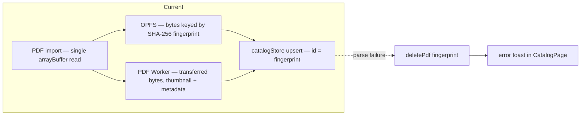

# Stratum — Domain Model

Shared language between developers and AI. Use these terms — never synonyms.

## Subsystems

- **Flipbook Engine** — @react-three/fiber (R3F) 3D book renderer (planned — deps not installed). Single-page view only. No 2D/slider/reader modes.
- **3D Bookshelf** — R3F render of the user's book catalog (planned — deps not installed). Books as 3D meshes with cover textures.
- **Projected Text Layer** — HTML overlay on top of the R3F canvas. Extracted pdfjs-dist text items positioned in screen-space (planned — deps not installed). Enables text selection, copying, and highlighting without interfering with canvas interaction.
- **AI Assistant** — Gemini-powered chat with streaming, text-to-speech.
- **Storage** — OPFS for binary PDFs (`savePdf`/`deletePdf` by SHA-256 fingerprint). Structured metadata is in-memory only — Dexie is planned, not installed. `lib/storage/opfs.ts` + `lib/storage/types.ts`
- **PDF Worker** — Dedicated Web Worker (Comlink) for pdfjs-dist document parsing: metadata (title, author), page count, and page-1 thumbnail. The main thread transfers the bytes (no clone); a page-render error never kills metadata.
- **Search Worker** — Dedicated Web Worker (Comlink) for MiniSearch full-text indexing (planned — deps not installed).

## Viewer Model (3D-Only)

- **Single Page View** — One page at a time, centered in the viewport. The only supported page mode.
- **Cover Types** — Four levels of 3D cover detail: `none` (all pages flat), `plain` (flat cover), `basic` (raised spine), `ridge` (ridged spine with depth).
- **Page Zoom** — Three modes: `fit` (page fills viewport height), `width` (page fills viewport width), `custom` (free zoom slider).
- **Page Turn** — LTR only. Bezier curve animation driven by vertex math extracted from DearFlip's `stratum-engine-legacy.js`.
- **Toolbar** — Edge-anchored bar movable between `top`, `bottom`, and `hidden`. Position persisted in toolbarStore.
- **Theme Toggle** — Sun/moon icon toggle. Icon morphs between `Sun` and `MoonStar` via morphicons (`MorphIcon`, spring "snappy", `reducedMotion="user"`). Positionable via `position` prop (9 named spots; default `top-right` in app shell). `d` key shortcut. Uses `next-themes` and class-based dark mode.

## Entities

| Term                 | Definition                                                                            |
|----------------------|---------------------------------------------------------------------------------------|
| Book                 | A loaded PDF rendered as a single-page 3D flipbook                                    |
| Page                 | A single sheet within a Book                                                          |
| Shelf                | The 3D bookshelf view showing the user's Book collection                              |
| Viewer               | The R3F `<Canvas>` and scene graph rendering the Book                                 |
| Catalog              | The user's collection of Books (local-first; OPFS + in-memory catalog, Dexie planned) |
| Cover                | The 3D hardcover mesh (type: none/plain/basic/ridge)                                  |
| Page Turn            | The Bezier-curve page-flip animation between consecutive pages                        |
| Projected Text Layer | Transparent HTML overlay mapping extracted PDF text to 3D page screen-space           |
| Annotation           | Highlight, note, or drawing on a Page (future)                                        |
| Narration            | AI-generated text-to-speech reading of a Page (future)                                |
| Key Slot             | One of 10 BYOK API key rotation slots for Gemini                                      |

## State (Zustand stores)

- `catalogStore` — book list, import state, sort/filter
- `viewerStore` — current page, page count, zoom mode and level, cover type, isFullscreen
- `toolbarStore` — position (top/bottom/hidden), active drawers
- `settingsStore` — BYOK Gemini keys, dialog open state

## Workers (Comlink RPC)

- **PDF Worker** (`pdf.worker.ts`) — Comlink RPC. Loads a PDF from bytes passed by the main thread, extracts metadata (title, author, page count), and renders the page-1 thumbnail via OffscreenCanvas. Client: `pdf.import.ts`.
- **Search Worker** (`search.worker.ts`) — planned — deps not installed. Comlink RPC. Maintains a MiniSearch full-text index. Tokenizes extracted page text. Handles keyword queries and ranked search results.

## Data Flow

Target architecture (current: import → OPFS + PDF Worker → in-memory catalog):

## Responsiveness

Target viewports:
- **Desktop** (≥1024px): Full reader experience with drawers, edge-anchored toolbar, keyboard shortcuts
- **Tablet** (≥768px, <1024px): Adapted toolbar, touch gestures for page turn, collapsible drawers
- **Mobile** (<768px): Minimal chrome, swipe-only navigation, bottom-anchored toolbar, drawers as full-screen overlays

All three viewports must support the same core features: page turn, zoom, toolbar, TOC, text selection.
