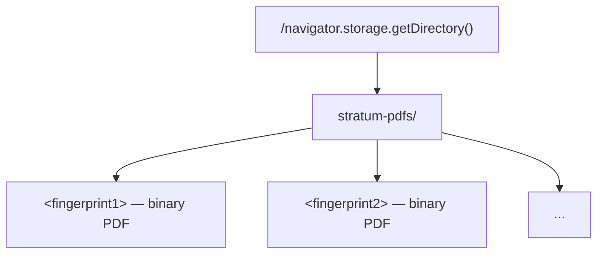

# OPFS Storage

**File**: `apps/web/src/lib/storage/opfs.ts`

Origin Private File System (OPFS) for binary PDF file storage.

## Storage Layout



All PDFs stored in a dedicated `stratum-pdfs/` subdirectory to avoid cluttering the OPFS root.

## Exports

### `savePdf(id: string, data: Blob): Promise<void>`

Saves PDF bytes to OPFS.

| Param  | Type     | Description                                          |
|--------|----------|------------------------------------------------------|
| `id`   | `string` | Unique file identifier (usually SHA-256 fingerprint) |
| `data` | `Blob`   | PDF bytes                                            |

**Throws**: If the file handle cannot be created (storage full, permissions). The writable is closed in `finally` even when the write fails.

### `deletePdf(id: string): Promise<void>`

Removes a stored PDF. Missing files are ignored (`NotFoundError` swallowed); other errors rethrow.

| Param | Type     | Description               |
|-------|----------|---------------------------|
| `id`  | `string` | File identifier to remove |

`loadPdf` is not built yet — the reader will need it when page rendering lands.

## Usage

```ts
import { deletePdf, savePdf } from '@/lib/storage'

await savePdf(fingerprint, new Blob([bytes], { type: 'application/pdf' }))
await deletePdf(fingerprint) // rollback on failed parse
```

## Limitations

- OPFS is scoped to the origin. Data cannot be shared across origins.
- Files persist until explicitly deleted or the user clears site data.
- Some browsers (Firefox) may not support OPFS. Fallback to IndexedDB blob storage is planned.

## Browser Support

| Browser      | OPFS Support |
|--------------|--------------|
| Chrome 86+   | Full         |
| Edge 86+     | Full         |
| Firefox 102+ | Full         |
| Safari 15.2+ | Full         |

## Dependencies

- No external deps. Uses `navigator.storage.getDirectory()` (File System Access API).
