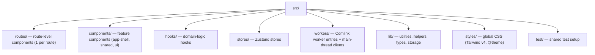
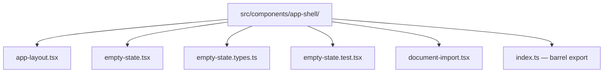

# Code Conventions

Supplementary to `biome.json` enforcement. All Biome rules apply; these cover what the linter cannot.

## File Naming

- Directories: `kebab-case`
- Component files: `kebab-case.tsx`
- Utility files: `kebab-case.ts`
- Store files: `kebab-case.store.ts`
- Worker files: `kebab-case.worker.ts`
- Type files: `kebab-case.types.ts` (types only — runtime helpers live in `*.helpers.ts`)
- Test files: co-located `*.test.ts` alongside source

## Directory Layout

## Barrels

- `routes/` and `components/` directories export through `index.ts` barrels; consumers never deep-import into feature internals
- `stores/`, `hooks/`, `workers/`, and `lib/` use direct file imports (no barrels)
- `components/shared/` holds cross-feature components (Fab, ThemeToggle, StratumWordmark, ErrorBoundary) behind one barrel

## Component Structure

## Imports

- **Never** write `import { useState } from 'react'` — unplugin-auto-import handles React hooks
- Type-only imports: `import type { Foo } from './types'` (enforced by Biome `useImportType`)
- No relative imports beyond `../../` — use path aliases if needed

## Zustand Stores

- One store file per domain (`viewer.store.ts`, `toolbar.store.ts`, `settings.store.ts`)
- Stores exposed via typed hooks: `useViewerStore`, `useToolbarStore`, `useCatalogStore`, `useSettingsStore`
- Never access store state directly — always through the hook
- Store actions prefer immer-style mutations over spread returns

## Comlink Workers

- Worker entry file exposes a typed API: `expose({ parsePdf })` (Comlink)
- Main thread gets a typed proxy: `wrap<PdfParser>(new Worker(new URL('./pdf.worker.ts', import.meta.url), { type: 'module' }))` — lazy singleton in `workers/pdf.import.ts`
- Never `postMessage` / `onmessage` — use Comlink exclusively
- Shared contract lives in a co-located `*.types.ts` (`workers/pdf.types.ts`)
- The client (`*.import.ts`) is main-thread facade code — it imports comlink + shared types only, and lives in `workers/` because `lib/` and `stores/` cannot import workers

## ShadCN UI (React Aria Base)

- **Use existing components first.** Every UI element comes from or composes from `src/components/ui/*` primitives.
- **No raw HTML/CSS for UI.** No inline styles, no custom `*.module.css`, no styled divs where a component exists.
- **Never modify primitives.** `src/components/ui/*` files are read-only. Compose with `cn()` for variants.
- **Semantic colors only.** `bg-primary`, `text-muted-foreground` — never raw oklch values.
- **React Aria composition.** Use `slot` prop for named children (for example `slot="close"`, `slot="title"`). No `asChild` (Radix) or `render` (Base UI) — React Aria uses slot-based composition.
- **Icons from Lucide only.** `lucide-react` for static icons; `morphicons` (`MorphIcon`, consuming `lucide` icon data) for morphing transitions — keep `lucide` and `lucide-react` versions aligned. Use `data-icon="inline-start"` or `data-icon="inline-end"` on icons inside Button.

## React Cosmos (UI Board)

- **Framework**: React Cosmos 7 (`react-cosmos-plugin-vite`) — reuses the app's Vite 8 config (Tailwind v4, unplugin-auto-import)
- **Server**: `pnpm cosmos` → `localhost:5000`
- **Location**: Co-located `*.fixture.tsx` next to source files; `src/cosmos.decorator.tsx` applies the dark class, imports `globals.css`, and centers fixtures with `p-8` padding
- **Fixture modules**: a `export default { Name1, Name2 }` map — one entry per component state (Cosmos reads the default export; top-level named exports are ignored). Component-function fixtures hold local state; presentational props pass directly
- **Scope**: Fixtures only for app components (`routes/`, `components/` excluding `ui/`). Vendored `ui/` primitives get no fixtures — shadcn registry is their source of truth
- **Workflow**: Build component → Create fixtures → Verify in Cosmos → Write tests → Integrate into routes

## Documentation

- **No ASCII/symbol diagrams.** Do not use box-drawing characters (`┌┐└┘├┤─│`), tree glyphs (`├── └──`), or emoji layouts in any doc. UI visual states live in Cosmos fixtures.
- **Structural diagrams are Mermaid only.** When a repo structure or data flow needs a picture, use Mermaid (`flowchart TD` / `flowchart LR`). Use a sentence or a table instead when possible.
- **Tables use the padded, aligned-pipe format.** Header row, separator, and cells space-padded so the pipes align vertically across all rows. The separator dashes span the full column width plus the framing spaces (`cell width + 2`), so the separator pipes line up with the data rows' pipes. Model: `docs/code/components/app-shell/empty-state.md` → Props. Escaped pipes (`\|`) are cell content and stay escaped.

## Testing

- **Framework**: Vitest + @testing-library/react + jsdom
- **Coverage**: V8 provider, threshold 80% lines/functions, 70% branches
- **Location**: Co-located `*.test.tsx` next to source files
- **Strategy**: Arrange → Act → Assert (AAA). No shared mutable state between tests.
  - **Zustand stores**: Unit test every action. Reset store via `beforeEach` to prevent cross-test pollution.
  - **Components (render)**: Assert elements exist via `getByRole`. Test conditional rendering.
  - **Components (behavior)**: Simulate interaction, assert state change (store or DOM).
  - **Pure functions**: Classic input → output unit tests.
  - **Workers**: Mock Comlink proxy, test main-thread integration.
  - **Routes**: Render route tree, assert correct component mounts.
- **No flaky tests**: Each test must be deterministic. No timers, no network calls without proper mocking.
- **Pre-merge**: Always run `pnpm test:coverage` before PR. Coverage must not degrade.

## Biome / Lint Rules

- **Zero tolerance**: Zero errors, zero warnings allowed at all times.
- **No `biome-ignore` / eslint-disable / ts-expect-error without explicit approval**:
  1. First attempt to fix the root cause through code restructuring.
  2. If no clean fix exists, explain the issue to the user with the options.
  3. Only apply suppress comment after user approval.
  4. Log every approved suppression in `docs/lint-suppressions.md` with file, rule, reason, and date.
- **anti-slop (oxlint)**: vendored plugin rules run via `pnpm lint` (`oxlint.config.ts`), plus curated built-ins with no Biome equivalent (`no-floating-promises`, `no-misused-promises`, `no-unnecessary-condition`, `no-unstable-nested-components`) with type-aware linting. Same suppression discipline — per-site `// oxlint-disable-next-line <rule>` comments only, logged in `docs/lint-suppressions.md`; never disable a rule wholesale.
- **Safe fixes**: `--unsafe` Biome fixes require user approval before batch application.

## Modularity & Composition

- **One concern per file**: If a file exceeds ~120 lines or requires scrolling to understand, extract sub-components or logic. Each file does one thing.
- **Logic separated from UI**: Animation math, state derivation, business rules live in pure functions (`.types.ts` or dedicated helpers) — never mixed into JSX markup. Components receive data and callbacks via props.
- **Composition over configuration**: Sub-components are composed by the parent via children/props, not configured via complex boolean flags. Keep prop interfaces flat.
- **Improve, do not duplicate**: When behavior is similar, extend the existing function with parameters — do not create a new function. This applies to components, hooks, and utilities.
- **Flat directories**: Prefer many small co-located files in one directory over deep folder hierarchies. A component directory contains: `component.tsx`, `component.types.ts`, `component.test.tsx`, sub-component files, and `index.ts` barrel.

## React Components

- Function components only (enforced by Biome `useArrowFunction`)
- No component definitions nested inside other components
- Props interfaces named `ComponentNameProps` — co-located in `.types.ts` when shared across files (tests, fixtures, composition); inline in the component file when consumed only by that component
- Use `<>` fragment syntax, never `<Fragment>` (enforced by Biome `useFragmentSyntax`) — keyed fragments are the only `Fragment` case
- Both `PascalCase` (components) and `camelCase` (utilities) accepted for function names
- Text inputs that commit business state use a local draft string and commit on blur/Enter — never commit each keystroke into the store

## Error Handling

- Never empty catch blocks (enforced by Biome `noEmptyBlockStatements`)
- Always chain errors with `cause`: `throw new Error('msg', { cause: originalError })`
- Never throw non-Error values (enforced by Biome `useThrowNewError`)

## TypeScript

- No explicit `any` without eslint-disable comment (Biome warns `noExplicitAny`)
- No non-null assertions `!` without explicit justification (Biome warns `noNonNullAssertion`)
- Strict equality `===` only (Biome error `noDoubleEquals`)
- Prefer `type` imports (Biome error `useImportType`)

## Promises

- Always handle promise rejections — no floating promises
- Use `await` in async functions, never ignore the result
- Prefer `Promise.all` over sequential awaits where independent

## Thinking Tools

When the user faces uncertainty (bug investigation, feature scoping, architecture decisions, prioritization, code review, or system analysis), the AI invokes the `thinking-tools` skill (`.agents/skills/thinking-tools/SKILL.md`). The skill maps the situation to an appropriate untools.co thinking framework and provides structured output. See the skill file for the full decision tree and trigger rules.
